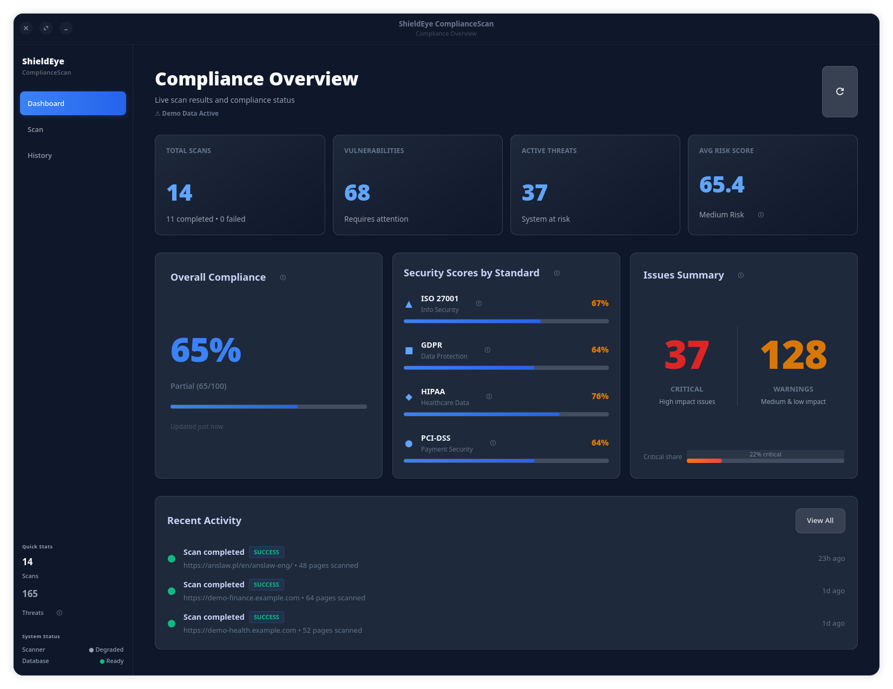
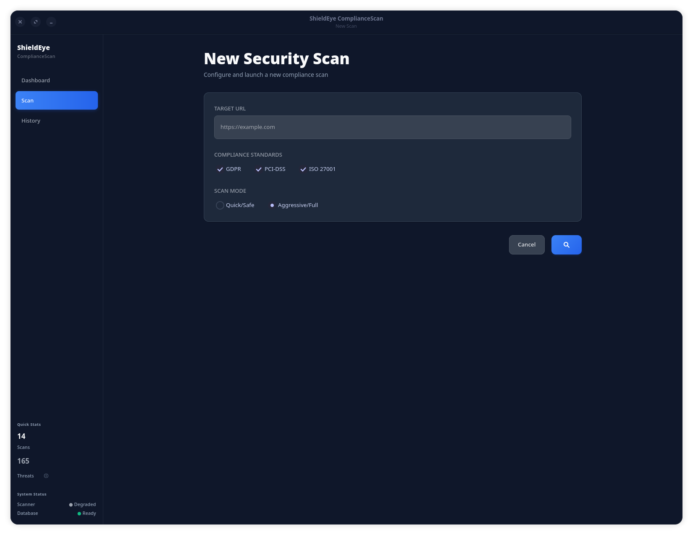
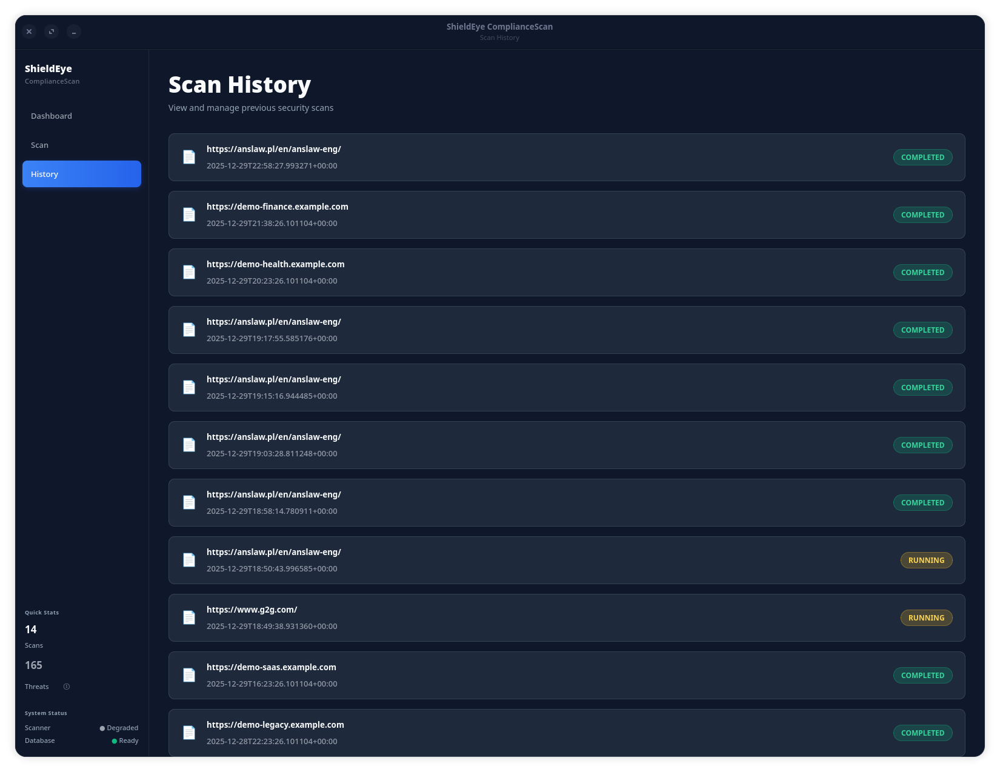

<div align="center">

# 🛡️ ShieldEye ComplianceScan

**Enterprise-Grade Compliance & Vulnerability Scanner**

*Real-time security scanning • Compliance validation • Professional reporting*

[](https://opensource.org/licenses/MIT)
[](https://www.python.org/)
[](https://www.gtk.org/)
[](https://archlinux.org/)
[](https://getfedora.org/)

[Features](#-key-features) • [Quick Start](#-quick-start) • [Screenshots](#-screenshots) • [Architecture](#-architecture) • [Contributing](#-contributing)

---

<!-- Hero Screenshot: Main Dashboard View -->


</div>

---

## 🎯 What is ShieldEye ComplianceScan?

ShieldEye ComplianceScan is a **comprehensive security and compliance scanning platform** designed for enterprise environments. It combines:

- 🔒 **Deep vulnerability scanning** with SSL/TLS, headers, and cookie analysis
- 📋 **Multi-standard compliance** (GDPR, PCI-DSS, ISO 27001, HIPAA)
- 🖥️ **Native GTK4 desktop interface** for intuitive operation
- 📊 **Professional PDF reporting** with CVSS v3.1 scoring

Whether you're a security professional, compliance officer, or DevSecOps engineer, ShieldEye provides actionable insights into your web application's security posture.

---

## ✨ Key Features

<table>
<tr>
<td width="50%">

### � Security Scanning
- **SSL/TLS Analysis:** Certificate validation, cipher strength, protocol versions
- **Security Headers:** CSP, HSTS, X-Frame-Options, CORS validation
- **Cookie Security:** Secure, HttpOnly, SameSite flag verification
- **Technology Detection:** Outdated libraries and frameworks
- **Form Security:** Autocomplete, HTTPS enforcement checks

</td>
<td width="50%">

### 📋 Compliance Validation
- **GDPR:** Privacy policy detection, cookie consent
- **PCI-DSS:** Payment form security, password handling
- **ISO 27001:** Security.txt, incident response
- **HIPAA:** Healthcare data protection standards
- **Multi-standard:** Simultaneous compliance checking

</td>
</tr>
<tr>
<td width="50%">

### 🖥️ Modern Interface
- **GTK4 Desktop GUI:** Native, responsive interface
- **Real-time Dashboard:** Live metrics and threat overview
- **Scan History:** Complete audit trail with filtering
- **Visual Reports:** Charts, graphs, and severity breakdown
- **Dark Theme:** Professional, eye-friendly design

</td>
<td width="50%">

### 📊 Enterprise Features
- **CVSS v3.1 Scoring:** Industry-standard risk assessment
- **PDF Reports:** Professional, branded documentation
- **REST API:** FastAPI with OpenAPI/Swagger docs
- **Database Persistence:** SQLite with full history
- **Multi-format Export:** JSON, CSV, XML, SARIF, Markdown

</td>
</tr>
</table>

---

## 🖼️ Screenshots

<div align="center">

| Dashboard | New Scan | History |
|:---------:|:--------:|:-------:|
|  |  |  |
| *Real-time compliance overview and metrics* | *Configure and launch security scans* | *Complete scan audit trail with filtering* |

</div>

---

## 🏗️ Architecture

ShieldEye ComplianceScan uses a **modular architecture** for maintainability and extensibility:

```
┌──────────────────────────────────────────────────────────────┐
│                     GTK4 Desktop GUI                          │
│                  (Python 3 + PyGObject)                       │
└─────────────────────────────┬────────────────────────────────┘
                              │ Direct API
                              ▼
┌──────────────────────────────────────────────────────────────┐
│                      Backend Core                             │
│              Scanner • Analyzer • Reporter                    │
└───────┬─────────────────────┬─────────────────────┬──────────┘
        │                     │                     │
        ▼                     ▼                     ▼
┌───────────────┐    ┌───────────────┐    ┌───────────────┐
│   Scanner     │    │   Analyzer    │    │   Reporter    │
│  (requests)   │    │ (Compliance)  │    │   (PDF/CSV)   │
└───────────────┘    └───────────────┘    └───────────────┘
        │                     │                     │
        └──────────┬──────────┴─────────────────────┘
                   ▼
    ┌─────────────────────────────────┐
    │        SQLite Database           │
    │   (Scans • Findings • History)   │
    └─────────────────────────────────┘
```

### Tech Stack

<p align="center">
  
  
  
  
  
  
  
  
  
</p>


## � Quick Start

### Prerequisites

| Requirement | Version | Notes |
|-------------|---------|-------|
| Python | 3.10+ | Tested on 3.10, 3.11, 3.12, 3.13 |
| GTK4 | 4.0+ | With PyGObject bindings |
| Linux | Any | Arch, Fedora, RHEL recommended |
| wkhtmltopdf | Latest | For PDF report generation |

### 1. Clone and Setup

```bash
git clone https://github.com/exiv703/ShieldEye_ComplianceScan.git
cd ShieldEye_ComplianceScan

# Create virtual environment
python -m venv .venv
source .venv/bin/activate
```

### 2. Install Dependencies

**Automated (Recommended):**
```bash
# Run the interactive launcher
./run.sh

# Select option 3: Install dependencies
```

**Manual Installation:**
**On Arch Linux:**
```bash
sudo pacman -S python-gobject gtk4 libadwaita wkhtmltopdf
pip install -r requirements.txt
```

**On Fedora/RHEL:**
```bash
sudo dnf install python3-gobject gtk4 libadwaita wkhtmltopdf
pip install -r requirements.txt
```

### 3. Launch the Application

```bash
# Interactive launcher with menu
./run.sh

# Or directly
python main_gtk.py
```

---

## 🎮 Using `run.sh`

The interactive launcher provides a user-friendly menu:

```bash
./run.sh
```

**Menu Options:**
1. 🚀 **Run ShieldEye ComplianceScan** - Launch the GUI application
2. 🗄️ **Reset history & local data** - Clear database and cache
3. 📦 **Install dependencies** - Automated dependency installation
4. 👋 **Exit** - Close the launcher

### CLI Interface

```bash
# Run a scan
python -m backend.cli.advanced scan https://example.com --save-db

# View scan history
python -m backend.cli.advanced history --limit 10

# Health check
python -m backend.cli.advanced health
```


## ⚙️ Configuration

### Environment Variables

```bash
# Database location
export SHIELDEYE_DB_PATH="$HOME/.shieldeye/scans.db"

# Log directory
export SHIELDEYE_LOG_DIR="$HOME/.shieldeye/logs"

# Reports output
export SHIELDEYE_REPORTS_DIR="$HOME/.shieldeye/reports"
```

### Full Requirements

- **Python 3.10+** with pip and venv
- **GTK4** with libadwaita
- **PyGObject** (python3-gobject)
- **wkhtmltopdf** for PDF generation
- **SQLite3** (usually pre-installed)

---

## 🛠️ Development

### Local Setup (without Docker)

```bash
# Clone and setup
git clone https://github.com/exiv703/ShieldEye_ComplianceScan.git
cd ShieldEye_ComplianceScan

# Create virtual environment
python -m venv .venv
source .venv/bin/activate

# Install dependencies
pip install -r requirements.txt
```

### Running Tests

```bash
# Run all tests
pytest tests/ -v

# Run with coverage
pytest tests/ --cov=backend --cov-report=html
```

### Seeding Demo Data

```bash
# Populate database with realistic demo scans
python scripts/seed_demo_data.py
```

---

## 🤝 Contributing

1. Fork the repository
2. Create a feature branch (`git checkout -b feature/amazing-feature`)
3. Commit your changes (`git commit -m 'Add amazing feature'`)
4. Push to the branch (`git push origin feature/amazing-feature`)
5. Open a Pull Request

---

## 📜 License

This project is licensed under the **MIT License** - see the [LICENSE](LICENSE) file for details.

---

## 🙏 Acknowledgments

- Built with [GTK4](https://www.gtk.org/) and [libadwaita](https://gnome.pages.gitlab.gnome.org/libadwaita/)
- Powered by [Python](https://www.python.org/) and [PyGObject](https://pygobject.readthedocs.io/)
- Security scanning inspired by industry best practices

---

<div align="center">

**[⬆ Back to Top](#-shieldeye-compliancescan)**

</div>
