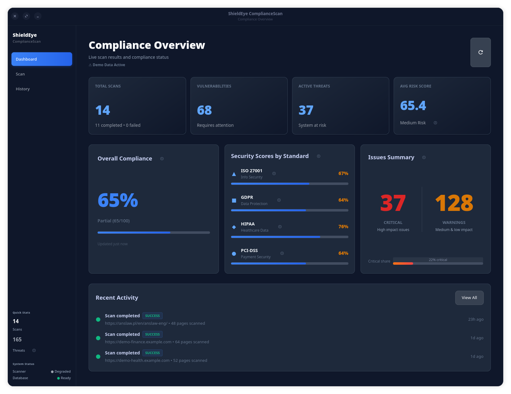
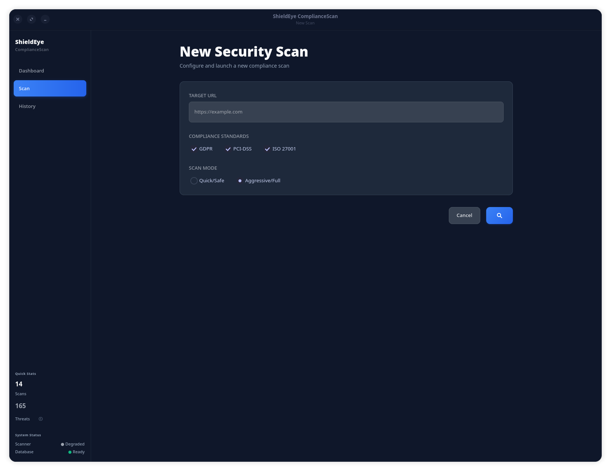
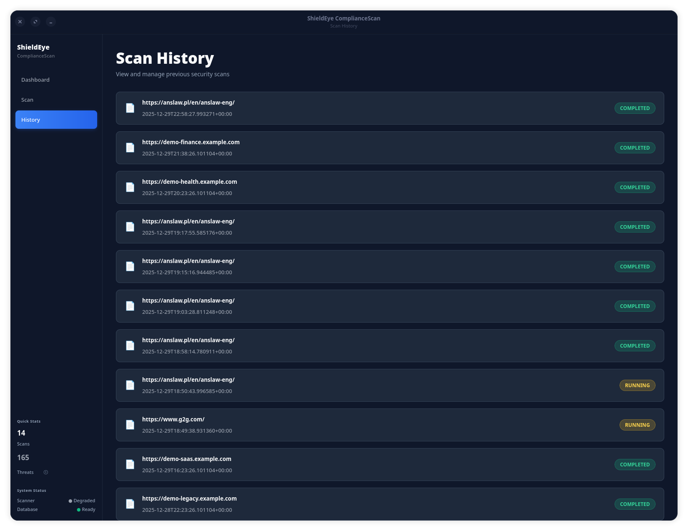

<div align="center">

# 🛡️ ShieldEye ComplianceScan

**Compliance and vulnerability scanner for GDPR, PCI-DSS and ISO 27001**

GTK desktop UI and a REST API, with JSON/SARIF reporting.

[](https://opensource.org/licenses/MIT)
[](https://www.python.org/)
[](https://www.gtk.org/)
[](https://archlinux.org/)
[](https://getfedora.org/)

[Features](#-key-features) • [Quick Start](#-quick-start) • [Screenshots](#-screenshots) • [Architecture](#-architecture) • [Contributing](#-contributing)

---

<!-- Hero Screenshot: Main Dashboard View -->


</div>

---

## 🎯 What is ShieldEye ComplianceScan?

ShieldEye ComplianceScan is a **comprehensive security and compliance scanning platform** designed for enterprise environments. It combines:

- 🔒 **Deep vulnerability scanning** with SSL/TLS, headers, and cookie analysis
- 📋 **Multi-standard compliance** (GDPR, PCI-DSS, ISO 27001, HIPAA)
- 🖥️ **Native GTK4 desktop interface** for intuitive operation
- 📊 **Professional PDF reporting** with CVSS v3.1 scoring

Whether you're a security professional, compliance officer, or DevSecOps engineer, ShieldEye provides actionable insights into your web application's security posture.

---

## ✨ Key Features

<table>
<tr>
<td width="50%">

### � Security Scanning
- **SSL/TLS Analysis:** Certificate validation, cipher strength, protocol versions
- **Security Headers:** CSP, HSTS, X-Frame-Options, CORS validation
- **Cookie Security:** Secure, HttpOnly, SameSite flag verification
- **Technology Detection:** Outdated libraries and frameworks
- **Form Security:** Autocomplete, HTTPS enforcement checks

</td>
<td width="50%">

### 📋 Compliance Validation
- **GDPR:** Privacy policy detection, cookie consent
- **PCI-DSS:** Payment form security, password handling
- **ISO 27001:** Security.txt, incident response
- **HIPAA:** Healthcare data protection standards
- **Multi-standard:** Simultaneous compliance checking

</td>
</tr>
<tr>
<td width="50%">

### 🖥️ Modern Interface
- **GTK4 Desktop GUI:** Native, responsive interface
- **Real-time Dashboard:** Live metrics and threat overview
- **Scan History:** Complete audit trail with filtering
- **Visual Reports:** Charts, graphs, and severity breakdown
- **Dark Theme:** Professional, eye-friendly design

</td>
<td width="50%">

### 📊 Enterprise Features
- **CVSS v3.1 Scoring:** Industry-standard risk assessment
- **PDF Reports:** Professional, branded documentation
- **REST API:** FastAPI with OpenAPI/Swagger docs
- **Database Persistence:** SQLite with full history
- **Multi-format Export:** JSON, CSV, XML, SARIF, Markdown

</td>
</tr>
</table>

---

## 🖼️ Screenshots

<div align="center">

| Dashboard | New Scan | History |
|:---------:|:--------:|:-------:|
|  |  |  |
| *Real-time compliance overview and metrics* | *Configure and launch security scans* | *Complete scan audit trail with filtering* |

</div>

---

## 🏗️ Architecture

ShieldEye ComplianceScan uses a **modular architecture** for maintainability and extensibility:

```
┌──────────────────────────────────────────────────────────────┐
│                     GTK4 Desktop GUI                          │
│                  (Python 3 + PyGObject)                       │
└─────────────────────────────┬────────────────────────────────┘
                              │ Direct API
                              ▼
┌──────────────────────────────────────────────────────────────┐
│                      Backend Core                             │
│              Scanner • Analyzer • Reporter                    │
└───────┬─────────────────────┬─────────────────────┬──────────┘
        │                     │                     │
        ▼                     ▼                     ▼
┌───────────────┐    ┌───────────────┐    ┌───────────────┐
│   Scanner     │    │   Analyzer    │    │   Reporter    │
│  (requests)   │    │ (Compliance)  │    │   (PDF/CSV)   │
└───────────────┘    └───────────────┘    └───────────────┘
        │                     │                     │
        └──────────┬──────────┴─────────────────────┘
                   ▼
    ┌─────────────────────────────────┐
    │        SQLite Database           │
    │   (Scans • Findings • History)   │
    └─────────────────────────────────┘
```

### Tech Stack

<p align="center">
  
  
  
  
  
  
  
  
  
</p>


## � Quick Start

### Prerequisites

| Requirement | Version | Notes |
|-------------|---------|-------|
| Python | 3.10+ | Tested on 3.10, 3.11, 3.12, 3.13 |
| GTK4 | 4.0+ | With PyGObject bindings |
| Linux | Any | Arch, Fedora, RHEL recommended |
| wkhtmltopdf | Latest | For PDF report generation |

### 1. Clone and Setup

```bash
git clone https://github.com/exiv703/ShieldEye_ComplianceScan.git
cd ShieldEye_ComplianceScan

# Create virtual environment
python -m venv .venv
source .venv/bin/activate
```

### 2. Install Dependencies

**Automated (Recommended):**
```bash
# Run the interactive launcher
./run.sh

# Select option 3: Install dependencies
```

**Manual Installation:**
**On Arch Linux:**
```bash
sudo pacman -S python-gobject gtk4 libadwaita wkhtmltopdf
pip install -r requirements.txt
```

**On Fedora/RHEL:**
```bash
sudo dnf install python3-gobject gtk4 libadwaita wkhtmltopdf
pip install -r requirements.txt
```

### 3. Launch the Application

```bash
# Interactive launcher with menu
./run.sh

# Or directly
python main_gtk.py
```

---

## 🎮 Using `run.sh`

The interactive launcher provides a user-friendly menu:

```bash
./run.sh
```

**Menu Options:**
1. 🚀 **Run ShieldEye ComplianceScan** - Launch the GUI application
2. 🗄️ **Reset history & local data** - Clear database and cache
3. 📦 **Install dependencies** - Automated dependency installation
4. 👋 **Exit** - Close the launcher

### CLI Interface

```bash
# Run a scan
python -m backend.cli.advanced scan https://example.com --save-db

# View scan history
python -m backend.cli.advanced history --limit 10

# Health check
python -m backend.cli.advanced health
```


## ⚙️ Configuration

### Environment Variables

```bash
# Database location
export SHIELDEYE_DB_PATH="$HOME/.shieldeye/scans.db"

# Log directory
export SHIELDEYE_LOG_DIR="$HOME/.shieldeye/logs"

# Reports output
export SHIELDEYE_REPORTS_DIR="$HOME/.shieldeye/reports"
```

### Full Requirements

- **Python 3.10+** with pip and venv
- **GTK4** with libadwaita
- **PyGObject** (python3-gobject)
- **wkhtmltopdf** for PDF generation
- **SQLite3** (usually pre-installed)

---

## 🛠️ Development

### Local Setup (without Docker)

```bash
# Clone and setup
git clone https://github.com/exiv703/ShieldEye_ComplianceScan.git
cd ShieldEye_ComplianceScan

# Create virtual environment
python -m venv .venv
source .venv/bin/activate

# Install dependencies
pip install -r requirements.txt
```

### Running Tests

```bash
# Run all tests
pytest tests/ -v

# Run with coverage
pytest tests/ --cov=backend --cov-report=html
```

### Seeding Demo Data

```bash
# Populate database with realistic demo scans
python scripts/seed_demo_data.py
```

---

## 🤝 Contributing

1. Fork the repository
2. Create a feature branch (`git checkout -b feature/amazing-feature`)
3. Commit your changes (`git commit -m 'Add amazing feature'`)
4. Push to the branch (`git push origin feature/amazing-feature`)
5. Open a Pull Request

---

## Feature Flags

| Flag | Default | Description | MVP Scope |
|------|---------|-------------|-----------|
| COMPLIANCE_BENCHMARKS_ENABLED | true | Enable CIS/PCI-DSS/SOC2 benchmark execution | ✅ Yes |
| ALLOW_INSECURE_TARGETS | false | Permit scanning targets with invalid TLS (internal only) | ✅ Yes |
| ENABLE_REMEDIATION_SNIPPETS | true | Include copy-paste ready fix commands in reports | ✅ Yes |

## Remediation Snippets

```bash
# CIS 4.1.3: Ensure auditd is configured
# Generated by ShieldEye-ComplianceScan v0.1.0
sudo apt install auditd -y
sudo augenrules --load
sudo systemctl enable --now auditd
```

## Phase 2 Capabilities

- **Policy-as-code:** YAML/Rego parsing with `control_id` validation (`policy/validator.py`)
- **Control mapping:** CIS/PCI-DSS/SOC2/GDPR registries + remediation templates (`benchmark/engine.py`)
- **Async execution:** Idempotent, retry-aware benchmark orchestration (`benchmark/orchestrator.py`)
- **Integrations:** Typed clients for Core + SurfaceScan with SSRF-safe validation (`integrations/core_client.py`, `integrations/surfacescan_client.py`)
- **Reporting:** Copy-paste remediation snippets + JSON/SARIF export (`backend/reporting/exporters.py`)

## Phase 3 Capabilities

- **Resilience hardening:** Per-target rate limiting and circuit-breaker protections for upstream dependencies (`backend/utils/resilience.py`)
- **Observability:** `MetricsCollector` telemetry, Prometheus export toggle, and `trace_span` tracing hooks (`backend/utils/observability.py`)
- **Advanced correlation:** `CorrelationEngine` with heuristic + optional ML backend and tunable `confidence_threshold` (`integrations/correlation.py`)

## Production Deployment

- **Redis configuration:** Set `SHIELDEYE_REDIS_URL` to a highly available Redis instance to enforce distributed rate limits consistently across workers.
- **Prometheus scraping:** Start with `scrape_interval: 15s` for production visibility, then tune based on cardinality and ingestion cost.
- **ML correlation resources:** Enable `ENABLE_ML_CORRELATION` only on nodes sized for embedding inference; keep heuristic fallback enabled for graceful degradation.

## v1.0.0 Release Highlights

- Scanner, policy engine, integrations and reporting pipeline across `backend/`, `policy/` and `reporting/`.
- Policy-as-code: YAML/Rego validation, control mapping and idempotent async execution (`policy/validator.py`, `benchmark/engine.py`, `benchmark/orchestrator.py`).
- Typed ShieldEye-Core/SurfaceScan clients with a deterministic correlation fallback in `integrations/`.
- Optional Redis-backed resilience, observability hooks and monitoring endpoints (`backend/utils/resilience.py`, `backend/utils/observability.py`, `api/routes/monitoring.py`).
- Structured environment handling and runtime config validation in `backend/utils/config.py`.

## Migration Guide: v0.4.0-rc1 → v1.0.0

### Breaking changes

- None.

### Configuration updates

- Keep existing `SHIELDEYE_DB_URL` and `SHIELDEYE_REDIS_URL`; no rename required.
- Add/verify policy and monitoring controls:
  - `ENABLE_POLICY_CACHE`
  - `SHIELDEYE_ENABLE_REALTIME_MONITORING`
  - `SHIELDEYE_ALERT_WINDOW_SECONDS`
- Optional production toggles (default safe/off):
  - `SHIELDEYE_ENABLE_PROMETHEUS_EXPORT`
  - `SHIELDEYE_ENABLE_OPENTELEMETRY`
  - `SHIELDEYE_ENABLE_INTERACTIVE_REMEDIATION`
  - `ENABLE_GRC_EXPORT`

### Upgrade steps

1. Pull the GA release and reinstall dependencies:

```bash
git fetch --tags
git checkout v1.0.0
pip install -r requirements.txt
```

2. Refresh environment configuration from `.env.example`:

```bash
cp .env.example .env
# re-apply environment-specific values (DB URL, Redis URL, webhook endpoints)
```

3. Validate core flags and run tests:

```bash
pytest tests/ -v
python -m backend.cli.advanced health
```

4. Run a smoke scan and verify exports/monitoring paths:

```bash
python -m backend.cli.advanced scan https://example.com --save-db
python -m backend.cli.advanced history --limit 5
```

5. For detailed troubleshooting and rollout notes, see `docs/MIGRATION_GUIDE.md`.

## API Surface

> **MVP note:** All endpoints require Bearer token authentication. CLI access is available for local/development workflows.

| Method | Endpoint | Description | Permission |
|--------|----------|-------------|------------|
| `POST` | `/scans` | Create and queue a new compliance scan | `scan:write` |
| `GET`  | `/scans` | List recent scans with filtering | `scan:read` |
| `GET`  | `/scans/{id}` | Retrieve scan details and findings | `scan:read` |
| `DELETE` | `/scans/{id}` | Remove a scan and its findings | `scan:delete` |
| `GET`  | `/scans/{id}/export?format=sarif` | Export scan results (json, csv, xml, sarif, markdown) | `scan:read` |
| `GET`  | `/health` | Service health and dependency checks | - |
| `GET`  | `/templates` | List available scan templates | - |
| `GET`  | `/templates/{name}` | Get template configuration | - |
| `POST` | `/schedules` | Create a recurring scan schedule | `scan:write` |
| `GET`  | `/schedules` | List active scan schedules | `scan:read` |
| `DELETE` | `/schedules/{id}` | Cancel a scheduled scan | `scan:write` |
| `POST` | `/webhooks/subscribe` | Subscribe to scan-completion events | `config:write` |
| `GET`  | `/webhooks` | List webhook subscriptions | `config:write` |
| `POST` | `/users` | Create a new user account | `user:manage` |
| `POST` | `/api-keys` | Generate a scoped API key | - |
| `GET`  | `/stats` | Aggregated scan statistics | `scan:read` |

## Integration Diagram

See `docs/INTEGRATION_GUIDE.md` for Core/SurfaceScan data flow.

## Future Roadmap (Post-v1.0.0)

- **ML correlation calibration:** Environment-specific threshold tuning, model evaluation loops, and confidence quality dashboards
- **GRC API clients:** Native vendor API transports in addition to current payload formatting/webhook patterns
- **Policy UI:** Guided policy authoring, schema linting, and approval workflows for collaborative governance

---

## 📜 License

This project is licensed under the **MIT License** - see the [LICENSE](LICENSE) file for details.

---

## 🙏 Acknowledgments

- Built with [GTK4](https://www.gtk.org/) and [libadwaita](https://gnome.pages.gitlab.gnome.org/libadwaita/)
- Powered by [Python](https://www.python.org/) and [PyGObject](https://pygobject.readthedocs.io/)
- Security scanning inspired by industry best practices

---

<div align="center">

**[⬆ Back to Top](#-shieldeye-compliancescan)**

</div>

# Impact: Clear release notes + migration path enable safe adoption of v1.0.0 in production environments.
